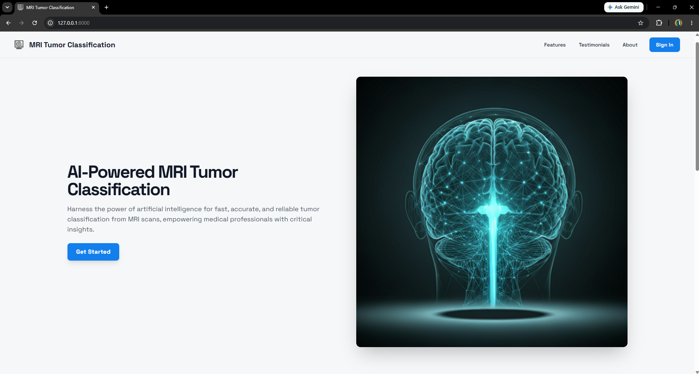
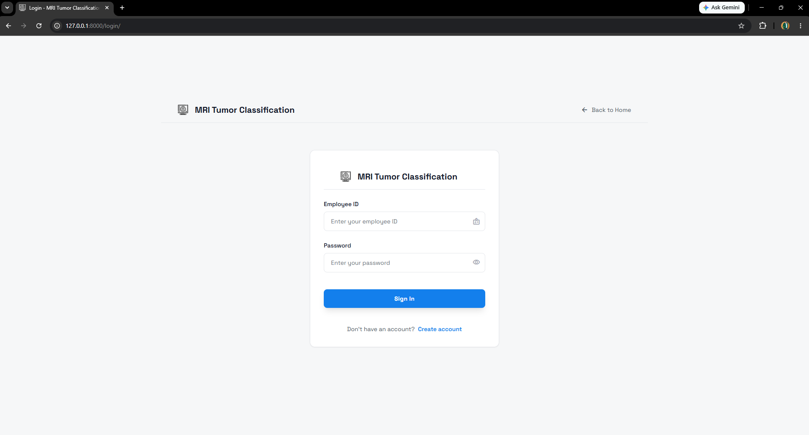
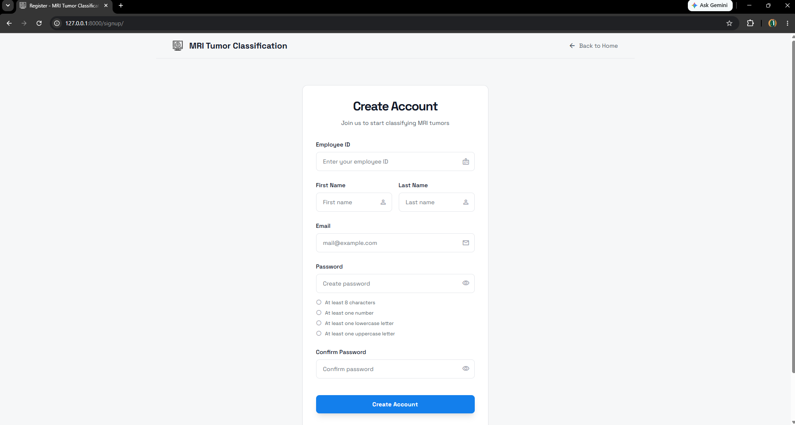
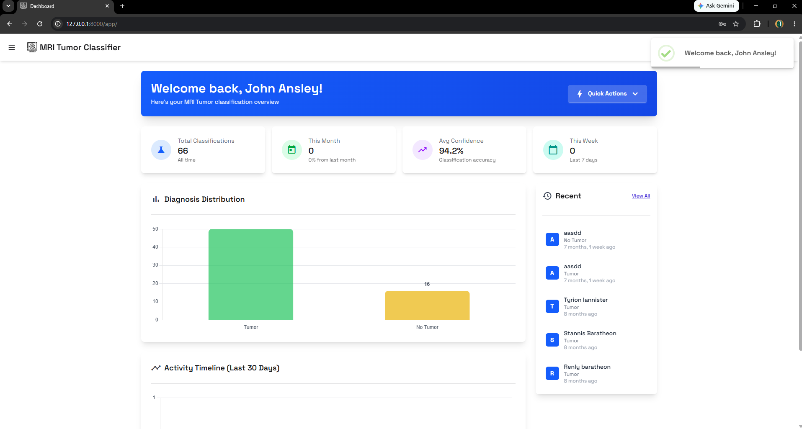
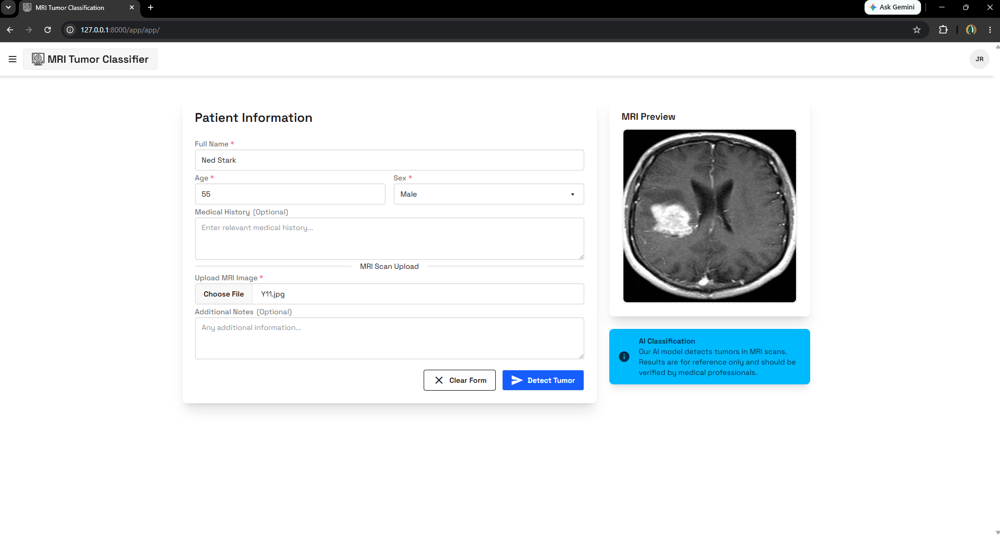
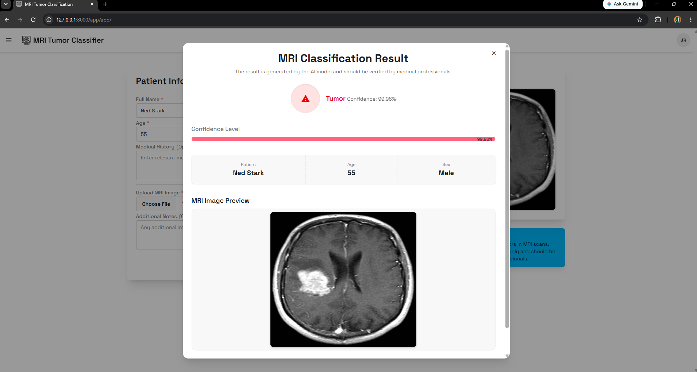
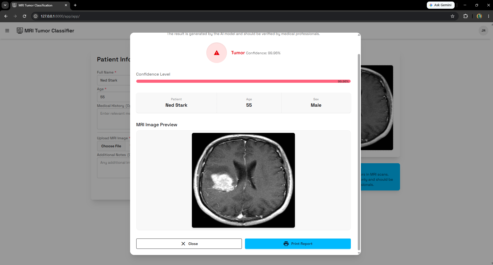
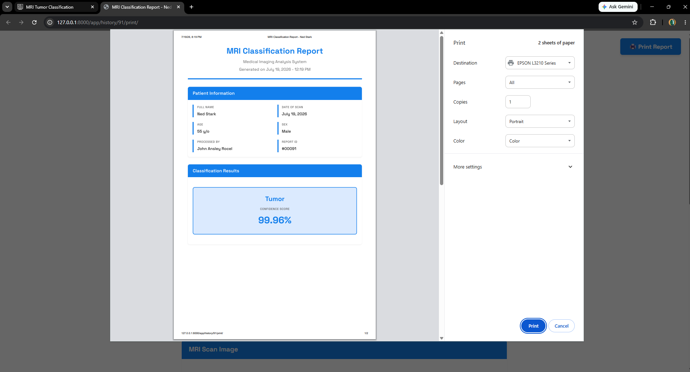
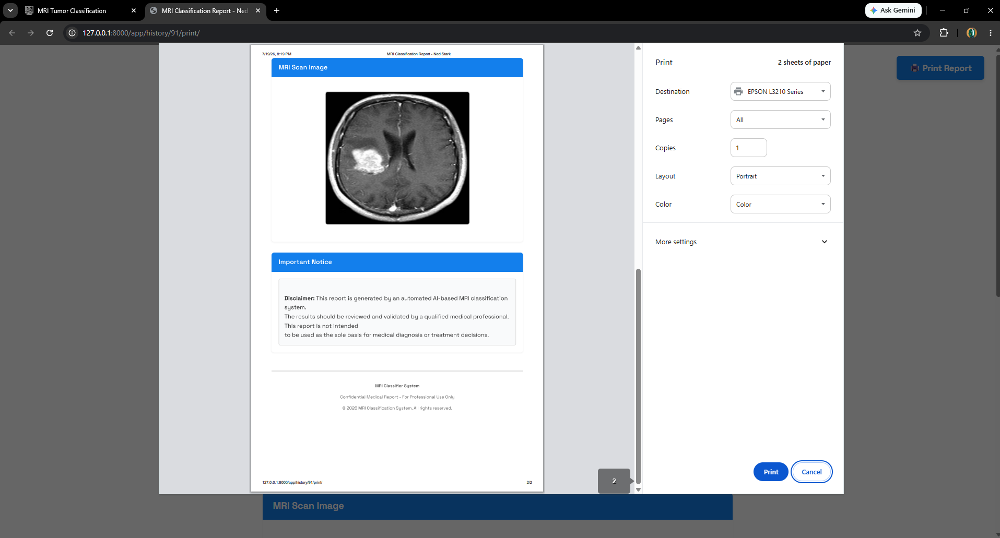

# Tumor Classification System

 **Project Overview**  
The **Tumor Classification System** is a full-stack web application designed to assist in the early detection and classification of tumors. The system provides an intuitive interface for medical professionals and researchers to upload diagnostic data, receive classification results, and print comprehensive reports. Built with security and user experience in mind, it features a complete authentication flow and a dedicated dashboard for managing classifications.

##  Key Features

* **Brain Tumor Classification:** Upload MRI scans to receive instant predictions ('Tumor' or 'No Tumor') powered by a pre-trained VGG16 Convolutional Neural Network (CNN) model using TensorFlow/Keras.
* **Patient Record Management:** Securely store and manage patient information alongside their MRI classifications, including age, sex, medical history, and clinical notes.
* **Interactive Dashboard:** View real-time analytics, including total classifications, monthly/weekly trends, average model confidence scores, diagnosis distribution, and a 30-day activity chart.
* **Advanced History & Filtering:** Search through past classifications by name, diagnosis, sex, or date range. Supports pagination, editing, and bulk deletion.
* **Export & Reporting:** Export classification history to CSV or generate professional, printable PDF/print reports for individual patient records.
* **Secure Authentication:** Full user authentication flow ensuring data privacy, where each user only accesses their own processed records.

##  Tech Stack

*  **Backend:** Python, Django
*  **Machine Learning:** TensorFlow, Keras (VGG16 architecture), OpenCV (Image Preprocessing), NumPy
*  **Database:** SQLite
*  **Frontend:** HTML, CSS, JavaScript (Django Templates)

##  Application Previews

### Landing Page

### Authentication
**Sign In**

**Sign Up**

### Dashboard

### Tumor Classification Flow
**Classification Form**

**Classification Results**

### Reporting
**Printable Results**

##  Setup & Installation

1.  Clone the repository.
2.  Install the required dependencies: `pip install -r requirements.txt`
3.  Apply database migrations: `python manage.py migrate`
4.  Start the development server: `python manage.py runserver`
